# Visual Diagrams

This document contains Mermaid diagrams that render automatically on GitHub.

## System Architecture Overview

```mermaid
graph TB
    subgraph Input["📥 INPUT LAYER"]
        JSON[JSON Files]
        PDF[PDF Documents]
        DOCX[DOCX Files]
        TXT[Text Files]
    end

    subgraph Processing["⚙️ DATA PROCESSING LAYER"]
        subgraph LangChain["LangChain Pipeline"]
            Loaders[Document Loaders<br/>PDFLoader, DocxLoader, TextLoader]
            Splitters[Text Splitters<br/>Recursive, Character, Token]
        end

        Direct[Direct Processing<br/>Format as training data]
        QAGen[QA Generation<br/>Claude Haiku API]

        Templates[Prompt Templates<br/>Alpaca, ChatML, Custom]

        subgraph Augmentation["Data Augmentation"]
            InstVar[Instruction Variations]
            Para[Paraphrase Templates]
            Norm[Whitespace Normalization]
        end
    end

    subgraph Training["🎓 TRAINING LAYER"]
        BaseModel[Base Model<br/>Llama/Qwen/Mistral]
        LoRA[PEFT/LoRA Config<br/>Rank, Alpha, Target Modules]
        Trainer[TRL SFTTrainer<br/>Sequence Packing, Chat Templates]
    end

    subgraph Output["📤 OUTPUT LAYER"]
        Adapter[LoRA Adapter Weights]
        Merged[Merged Model]
        Export[Exported Model<br/>GGUF/Quantized]
    end

    JSON --> Loaders
    PDF --> Loaders
    DOCX --> Loaders
    TXT --> Loaders

    Loaders --> Splitters
    Splitters --> Direct
    Splitters --> QAGen

    Direct --> Templates
    QAGen --> Templates

    Templates --> InstVar
    InstVar --> Para
    Para --> Norm

    Norm --> BaseModel
    BaseModel --> LoRA
    LoRA --> Trainer

    Trainer --> Adapter
    Adapter --> Merged
    Merged --> Export

    classDef inputClass fill:#e1f5ff,stroke:#01579b,stroke-width:2px
    classDef processClass fill:#fff3e0,stroke:#e65100,stroke-width:2px
    classDef trainClass fill:#f3e5f5,stroke:#4a148c,stroke-width:2px
    classDef outputClass fill:#e8f5e9,stroke:#1b5e20,stroke-width:2px

    class JSON,PDF,DOCX,TXT inputClass
    class Loaders,Splitters,Direct,QAGen,Templates,InstVar,Para,Norm processClass
    class BaseModel,LoRA,Trainer trainClass
    class Adapter,Merged,Export outputClass
```

## Data Preparation Workflow

## Training Pipeline

## Component Interaction

## RunPod Deployment Flow

## Class Diagram

## Sequence Diagram: QA Generation Flow

## State Diagram: Training Process

